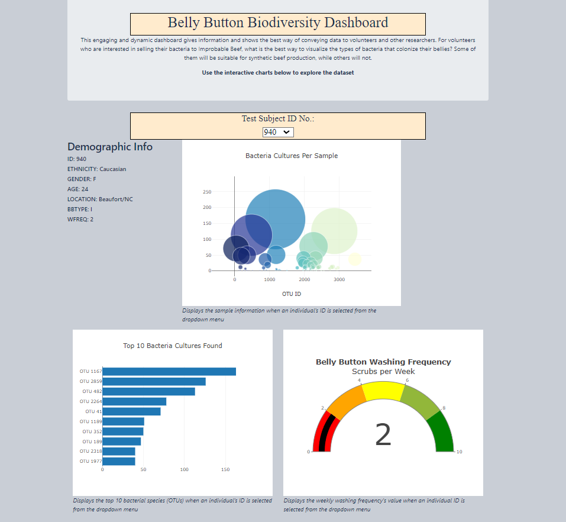
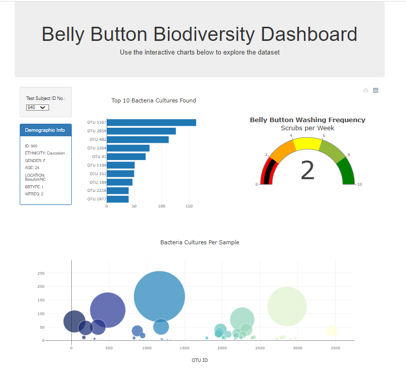

# Belly Button Biodiversity Dashboard -  Plotly
Visualizing bacterial data for each volunteer to see if they are eligible to sell their bacteria to Imperial beef company. Each volunteer will be able to identify the top 10 bacterial species in their belly buttons. 
## Purpose:
This engaging and dynamic dashboard gives information and shows the best way of conveying data to volunteers and other researchers. For volunteers who are interested in selling their bacteria to Improbable Beef, what is the best way to visualize the types of bacteria that colonize their bellies? Some of them will be suitable for synthetic beef production, while others will not.
## Analysis:
Each of her volunteers carries a variety of bacterial species in his or her belly button. There is also information on the number of bacteria found for each species. Out of the entire belly button dataset, we wish to select only the data that pertain to one individual. Dashboard allow us to extract a specific property from each object and display demographics on volunteer and samples. We sort the most common species of bacteria and then display the results on the webpage

## Summary:
The dashboard display the most common bacterial cultures per sample, top 10 bacteria cultures found and belly button washing frequency. Improbable Beef is looking for people who carry a large number of a certain bacterial species, and  volunteers should be able to quickly use the dashboard to figure out whether they are eligible to sell their bacteria to the company. 